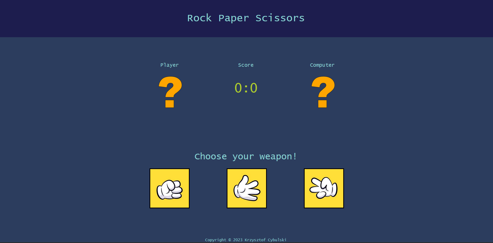
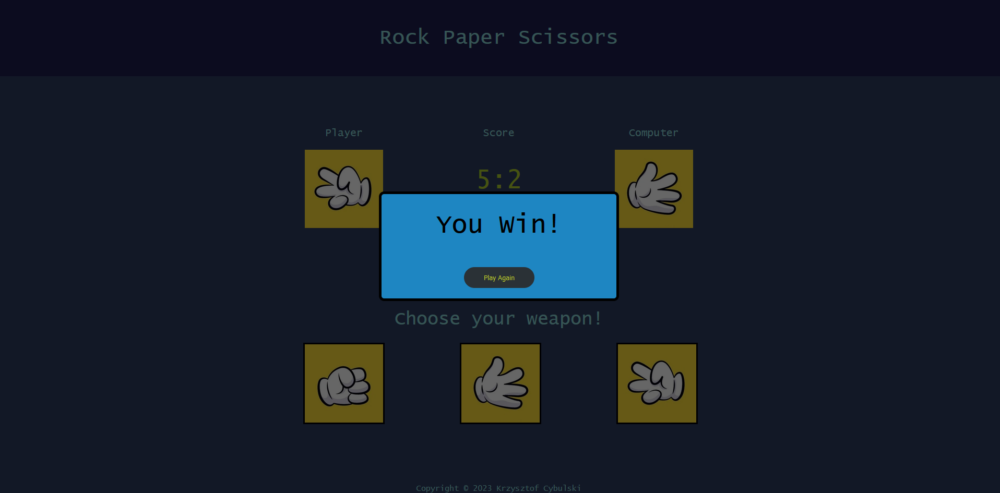

# Rock-Paper-Scissors application

The Rock Paper Scissors App brings the classic hand game to your mobile device, offering a simple and enjoyable gaming experience. Compete against the computer, which randomly selects its moves. The game progresses until either the player or the computer reaches 5 points.

## Built with

* HTML
* CSS
* JavaScript

## Screenshots

An Example of one round played

## Contact

Krzysztof Cybulski - kcybulski205@gmail.com

Project link: https://github.com/zysio/Rock-Paper-Scissors.git

## License

Distributed under the MIT License. See LICENSE.txt for more information.